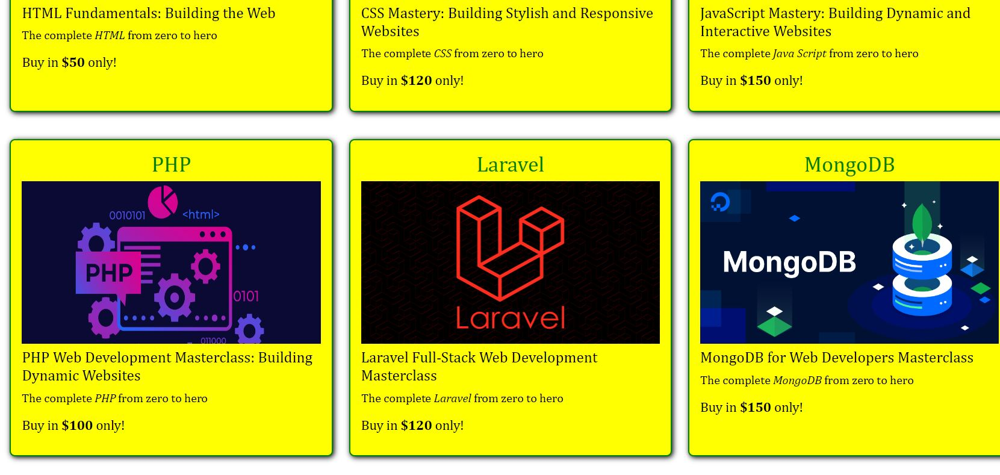
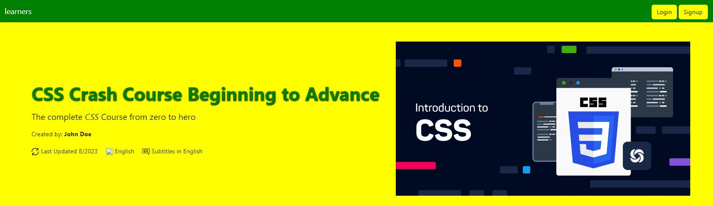

# <i><b>learners</b></i> - A Learning Management System (LMS)📝 

<i><b>learners</b></i> is an LMS that helps students learn a variety of things of their own choosing at a very affordable cost. It's a place where students can share their reviews regarding the courses they have enrolled in, as well as explore a variety of other courses.

## learners Outlook

All courses offered by <i><b>learners</b></i> are categories such as `Web Development` , `App Development`,`Game Development`, `Photography`, `Video Editing` and `Graphics Designing` 

## Start learning by simply <i>Signing up</i>

<i><b>learners</b></i> provide a role base login system where user can either be <b>Teacher</b> or a <b>Student</b> or it may be <b>Admin</b> in some cases, and each one of the paticular user will land on it's respective portal as per their roles after logging in.

## Login to your account and Start learning

# <i><b>Student's Portal Outlook</b></i>

## Clicking on a Particular Category Course i.e Web Development

When a student clicks on web development, all courses related to web development will be appear.Similary in case of `Game Development` or any other categorized course. Each Category has it's own respective courses.

Taking Web development as a example, we will now see that how window appears to a user when a user click on it.

### <b><i>Web Development Courses</i></b>

## Clicking on a Particular Course of Web Development i.e CSS

When a student clicks on CSS Course, a new window related to css course will be appear.Similary in case of `HTML` or any other course. Each Course has it's own specifications.

Taking CSS as a example, we will now see that how window appears to a user when a user click on it.

## Buy Course to Start Your Learning Journey with <i><b>learners</b></i>

When a user clicks on `Buy Now` button, a window will appear that will provide all billing facilities to a user.

### Fill all details and click on `Pay Now` button to buy course

After paying particular amount for each course, user will get it's course🎉.

### <i><b>Course Video</b></i>

User can not only watch video of the respective course but also they can `download video` , `control playback speed` and can have `full screen view`. 

### <i><b>Student's Reviews</b></i>

Users can add reviews about the course that will be displayed at <i><b>learners</b></i> as a part of user experience that what people think about the course they have been enrolled into and whether they find it useful or not?

## Logout of <i><b>learners</b></i>

Users can simply `Logout` by pressing the `Logout Button` at the top right corner of application and can `Login` to their account again whenever they want. 

# <i><b>Admin's Portal Outlook</b></i>

# <i><b>Teacher's Portal Outlook</b></i>

## Admin and Teacher Authorities

Admins and Teachers have not only access to `students's portal` but also they can `Add New Course` , `View All Courses` , `Add New Categories` , `View All Categories` and `Manage All Courses & Categories`.

### View All Courses

### Create Course

### View All Categories

### Create Category

## Admin Authorities

Admins have not only access to `Students's Portal` but also they can `Teacher's Portal`.
In short, Admin is a person having 100% authority of doing changes to <i><b>leaners</b></i>.

## Give a Star⭐

Give a Star if you Liked it❤️